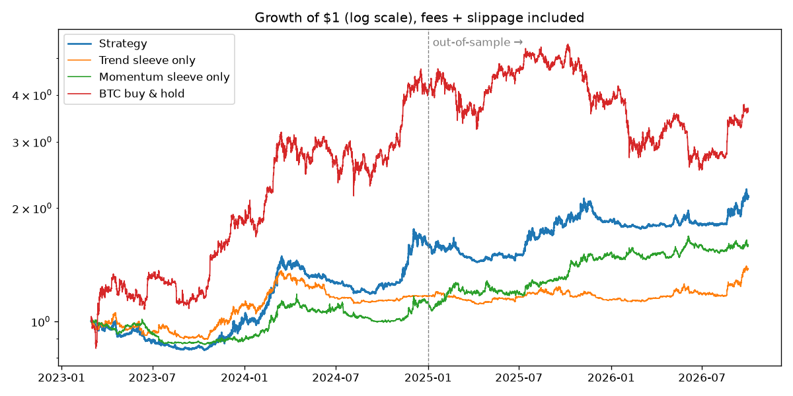

# Roostoo Quant Trading Bot — Team Joaquin (USYD)

[](https://github.com/moualexander23-eng/trading-bot/actions/workflows/tests.yml)

An autonomous crypto trading bot for the SIG × Roostoo APAC University Quant Trading Hackathon.
It runs on AWS EC2, trades spot longs and shorts on the Roostoo mock exchange through its REST
API, and logs every decision so it can be audited.

**In one sentence:** a two-sleeve, volatility-aware portfolio. A *long-only time-series trend*
sleeve participates in sustained rallies and steps aside in sell-offs. A *long/short
cross-sectional momentum* sleeve takes directional views on individual coins: long the
strongest, short the weakest, held for days. Its longs and shorts roughly offset, so it earns
relative-strength persistence whatever the market does. Both sleeves are rebalanced slowly, with
maker-first execution, so fees don't eat the edge.

---

## 1. Why this strategy

Finalists are screened on return, then **50% on a composite risk-adjusted score
(0.4·Sortino + 0.3·Sharpe + 0.3·Calmar) and 50% on this repository**. Judges also ask whether a
strategy's edge would hold up in real markets (see [§5](#5-why-the-edge-is-real-not-a-simulator-artefact)).
We designed for that objective:

| Objective | Design response |
|---|---|
| Positive return over 14 days | Two independent, persistent return sources (trend + relative momentum) |
| High Sortino / Calmar (penalise downside & drawdown) | Trend sleeve goes to cash in downtrends; momentum sleeve's longs and shorts offset, so a market-wide crash is not our P&L |
| High Sharpe | The sleeves' daily returns are ~0.1 correlated, so combining them cuts volatility more than return |
| Fees (0.1% taker / 0.05% maker) | Daily (staggered) rebalancing, a 2% no-trade band, limit orders first |
| "No HFT / market-making / arbitrage" rule | Every position is a directional view held for days (~5 days on average). About 12 orders a day, all at 3 scheduled rebalances. We never quote both sides of a market and never trade a coin back and forth for the spread |
| "Active every trading day" rule | Three staggered rebalances per day guarantee daily, strategy-driven trades |

## 2. How we got here (research log)

We downloaded 3.75 years of hourly Binance data for every coin listed on Roostoo (Roostoo's
prices are streamed from Binance). We screened signal families on **2023–2024 (in-sample)** and
only then checked **2025–2026 (out-of-sample)**. Every test charged 0.1% fee + 3 bp slippage
per side. Returns below are the mean over rolling 14-day windows.

| Idea tested | Result | Decision |
|---|---|---|
| Hourly-rebalanced trend, top-5 coins (our first version) | Turnover ~200% of NAV/day → **−3% per 14 days** after fees | Rejected: fees dominate |
| Short-horizon time-series trend (1–7 days), hourly | Negative after costs | Rejected |
| Slow time-series trend (7/14/30 days), daily | **+1.0% IS / +0.7% OOS** | **Kept → trend sleeve** |
| Cross-sectional short-term reversal (4h–14d) | Negative in both periods | Rejected |
| Cross-sectional momentum, 1–3 day lookback | Negative after costs | Rejected |
| Cross-sectional momentum, 14-day lookback, long/short | **+0.7% IS / +1.1% OOS**, robust to k = 4–6 | **Kept → momentum sleeve** |
| Low-volatility factor (long low-vol, short high-vol) | Negative in-sample | Rejected |
| "Supply overhang" (short newly listed tokens) | OOS positive, IS ≈ 0, flips sign with small spec changes, squeeze risk | Rejected: not robust |
| Tight drawdown governor (de-risk from −3%, floor at −8%) | Lowered mean return *and* median composite: it sells at local lows | Replaced by an emergency brake (−8% → −15%) |
| One daily rebalance time vs three staggered tranches | Tranches slightly better, less dependent on one arbitrary hour | **Kept: 3 tranches** |

The edges are modest and we say so plainly: crypto at these horizons is close to efficient once
fees are paid. That's why the design combines several weak, uncorrelated edges with tight cost
control, rather than betting on one strong signal.

## 3. Strategy specification

All logic is in [`bot/strategy.py`](bot/strategy.py). It is a pure function of price/volume
history, and **the exact same function** drives both the backtester and the live bot.

**Universe.** About 40 liquid Roostoo crypto pairs (see [`config/settings.yaml`](config/settings.yaml)).
Tokenized stocks are excluded because their history is too short to validate. PAXG and coins
whose tick size makes the spread more than ~5 bp are also excluded. Each hour, eligibility =
the top N by trailing 7-day USD volume, with at least 800 h of history.

**Trend sleeve (long-only, directional)** — top 15 coins by liquidity
1. For each lookback L ∈ {7, 14, 30 days}, compute a trend t-stat: `log(P_t / P_{t-L}) / (σ_hourly · √L)`,
   clipped to [−2, 2].
2. Score = the average of the three, in [−1, 1]. Multi-horizon averaging avoids betting on one parameter.
3. Hold coins with a positive score, weight ∝ score / volatility.
4. Scale the sleeve to a **25% annualised volatility target**. Portfolio vol uses a
   constant-correlation (ρ = 0.7) model, so exposure falls automatically when markets get wild.
   In a broad sell-off every score turns negative and the sleeve goes to cash.

**Momentum sleeve (long/short relative strength)** — top 25 coins by liquidity
1. Rank coins by 14-day return *relative to the universe average*.
2. Long the top 5 and short the bottom 5, inverse-volatility weighted within each side.
3. Gross 60% (30% long, 30% short), so net market exposure is ~0. The 14-day ranking changes
   slowly, so positions are typically held for several days.

**Portfolio construction.** Sum the sleeves (a coin can be in both, so they may net off), cap
each coin at ±25% of NAV, and cap total gross (longs + short collateral) at 95% of NAV. There is
no leverage: on Roostoo, short collateral is funded from USD just like longs.

**Rebalancing.** Targets are refreshed in three staggered tranches, each moving one third of the
book. They use the hourly bars that open at 00:00, 08:00 and 16:00 UTC, so trades happen just after
those bars close, at ~01:01, 09:01 and 17:01 UTC. A coin is traded only if its weight is off by more than 2% of NAV
(or it must be closed). The bot still checks hourly, so price drift beyond the band is corrected,
exactly as in the backtest.

## 4. Backtest

Simulator: [`backtest/engine.py`](backtest/engine.py). It is an event-style loop that mirrors the
live bot: mark to market, apply the risk overlay, trade only outside the band, and charge
**0.1% + 3 bp on every fill**. That is conservative, since live fills that rest as maker pay
0.05%. Report: [`backtest/evaluate.py`](backtest/evaluate.py) → [`backtest/results/`](backtest/results/).



**Full history, Mar-2023 → Sep-2026 (continuous):**

| | Strategy | Trend sleeve only | Momentum sleeve only | BTC buy & hold |
|---|---:|---:|---:|---:|
| CAGR | 23.9% | 9.4% | 14.0% | 43.4% |
| Annualised vol | 19.9% | 12.7% | 14.8% | 46.3% |
| Sharpe | **1.16** | 0.74 | 0.97 | 1.00 |
| Sortino | **1.84** | 1.10 | 1.48 | 1.54 |
| Max drawdown | **20.7%** | 18.5% | 15.9% | 53.8% |
| Calmar | **1.15** | 0.51 | 0.88 | 0.81 |

**Competition-shaped test.** We started a fresh $100k all-cash portfolio every 2 days, ran each
for 14 days, and scored it like the judges (642 windows):

| | Strategy IS 23-24 | BTC IS 23-24 | Strategy OOS 25-26 | BTC OOS 25-26 |
|---|---:|---:|---:|---:|
| Mean 14-day return | +1.3% | +3.5% | **+1.2%** | −0.1% |
| 10th percentile return | −5.2% | −7.1% | **−4.8%** | −10.7% |
| Median max drawdown | 5.3% | 7.6% | **5.1%** | 7.6% |
| 90th pct max drawdown | 8.5% | 15.1% | **8.3%** | 16.0% |
| Median composite score | 0.46 | 3.82 | **0.80** | 0.12 |
| Trades per day | 12 | – | 12 | – |
| Min. active days (of 14) | 13 | – | 13 | – |

How to read this: in strong bull markets (2023–24) a long-only BTC holder beats us on raw
return, because we are only ~40% net long. Across the full cycle, though, we deliver better
risk-adjusted returns with **less than half the drawdown**. In the choppy/bearish 2025–26
out-of-sample period, the strategy kept compounding while BTC went nowhere.

**Caveats we take seriously.**
- Universe survivorship: the coin list is today's Roostoo listing.
- Hourly bars hide intra-hour moves.
- Parameter choices were made in-sample, but we screened ~40 variants, so some selection bias
  remains. We picked parameters from robust *regions* (neighbouring values also work), not single
  best points.
- A 14-day result is dominated by noise. The strategy is roughly a coin flip with positive skew
  over any single fortnight, and its edge shows up over many.

Reproduce:
```bash
python -m backtest.download_data --start 2023-01-01   # ~10 min, Binance public data
python -m backtest.evaluate                           # writes backtest/results/
```

## 5. Why the edge is real, not a simulator artefact

The organizers asked teams to focus on edges that "come from the market itself". Ours do:

- **Documented return sources.** Time-series momentum (Moskowitz, Ooi & Pedersen, *JFE* 2012)
  and cross-sectional momentum (Jegadeesh & Titman, *JF* 1993) are among the most replicated
  effects in finance. Both have been documented in crypto specifically (Liu & Tsyvinski, *RFS*
  2021; Liu, Tsyvinski & Wu, *JF* 2022).
- **Tested on a real exchange's prices.** The backtest uses Binance hourly data, not Roostoo's
  simulator. It charges **taker fees plus slippage on every fill**, so the result does not
  depend on maker fills, queue position or any matching-engine behaviour.
- **Execution caveat, stated plainly.** Live, ~55% of our filled notional is maker. A real order
  book would fill fewer passive orders at the touch, and with more adverse selection, because
  queues are real. That is why the backtest ignores the maker discount entirely: the strategy
  is viable with 100% taker execution.
- **Capacity.** We trade only the 25 most liquid coins. Our positions ($2k–$25k) are a tiny
  fraction of each coin's daily volume ($10M–$1B+), so the same trades could be executed on a
  real exchange without moving the price.

## 6. Transaction costs: maker vs taker

| Lever | Effect |
|---|---|
| Slow signals (7–30 day horizons) + daily tranches | Turnover ~37% of NAV/day, vs ~200% for our first hourly version |
| 2% no-trade band | Skips small rebalances where the fee exceeds the benefit |
| **Maker-first execution** | Spot orders are first posted as LIMIT at the touch (buy @ best bid, sell @ best ask), paying 0.05% if filled. After 120 s anything unfilled is cancelled, and the residual is completed at MARKET (0.1%). This only executes our *own* rebalance in one direction; it is not market making (we never quote both sides) |
| Shorts at market | Roostoo charges 0.1% on short opens/closes regardless of order type, so there is no point resting them |
| Backtest charges taker on everything | Live costs should come in *below* the backtest |

## 7. Risk management

| Layer | Rule |
|---|---|
| Position | Per-coin cap ±25% NAV; inverse-vol sizing so no coin dominates risk |
| Portfolio | Trend sleeve vol-targeted to 25%; gross ≤ 95% NAV; no leverage |
| Market regime | Trend sleeve auto-exits in downtrends; momentum sleeve is beta-neutral |
| Drawdown brake | From −8% off peak NAV, exposure scales linearly down to 30% at −15%. Checked every 15 min, not just hourly |
| Liquidity | Only top-volume coins; coins with wide Roostoo spreads (tick size > ~5 bp) excluded from the candidate list |
| Operational | Rate limiter (25 calls/min vs 30 limit); retries with backoff; **order calls are never blindly retried** (no double fills); stray pending orders cancelled every cycle; server-clock sync for signed requests; stale-data guard (a coin with no fresh price is not traded); falls back to Roostoo ticker if Binance is unreachable; auto long-only if the exchange rejects shorts; systemd restarts the process on crash or reboot; state (peak NAV) persisted to disk |

## 8. Trading engine

```
             ┌─────────────── every hour at HH:01 UTC ───────────────┐
Binance ──►  market_data.py ──► strategy.py ──► risk.py ──► execution.py ──► Roostoo API
klines       (hourly bars,      (target         (drawdown    (diff vs        (roostoo_client.py:
(public)      cache, fallback    weights)        brake)       holdings,       signing, rate limit,
              to Roostoo                                      limit→market)   retries)
              ticker)                     every 15 min: mark-to-market + drawdown check
                                                     │
                                       trade_log.py ─┴─► logs/trades.csv, equity.csv,
                                                          signals.csv, bot.log, api.log
```

| File | Role |
|---|---|
| `bot/main.py` | Scheduler and entry point. Wraps every cycle so the loop never dies |
| `bot/roostoo_client.py` | HMAC-SHA256 signing (verified against Roostoo's doc example in tests), rate limiting, retries |
| `bot/market_data.py` | Hourly bar cache from Binance, with Roostoo-ticker fallback |
| `bot/strategy.py` | Signals and target weights (shared with the backtest) |
| `bot/risk.py` | Drawdown brake (shared with the backtest) |
| `bot/execution.py` | Turns targets into BUY / SELL / SHORT_OPEN / SHORT_CLOSE orders with precision rounding and cash budgeting |
| `bot/paper.py` | Paper-trading client: live Roostoo prices, simulated wallet, same fee rules |
| `bot/trade_log.py` | CSV audit trail |
| `backtest/` | Data download, simulator, metrics, report |
| `scripts/` | Read-only connection check; order smoke test (refuses the competition account) |
| `deploy/` | EC2 install (systemd service) and update scripts |

**Audit trail** (`logs/`, git-ignored, produced live):
- `trades.csv`: one row per order, with time, pair, side, type, qty, limit price, target vs
  current weight, success flag, order id, status, fill qty/price, commission, error, and the
  **signal reason** (each coin's weight, trend score and momentum score at decision time).
- `equity.csv`: NAV, cash, gross exposure, peak, drawdown and brake multiplier at every check.
- `signals.csv`: full target-weight and score vectors every hour.
- `api.log`: every API call with endpoint, success flag, latency and error message.

## 9. Running it

```bash
pip install -r requirements.txt
cp .env.example .env              # then paste your keys into .env (never commit it)
python -m pytest -q               # unit tests
python -m bot.main --paper --once # one cycle, simulated $100k wallet, no keys needed
python -m scripts.check_connection # read-only check of your keys
python -m scripts.smoke_test      # TEST account only: tiny buy/sell/limit/cancel
python -m bot.main                # live loop (account chosen by BOT_ACCOUNT in .env)
```
On EC2 (Amazon Linux 2023): `bash deploy/install.sh`, create `.env`, then
`sudo systemctl enable --now roostoo-bot`. Use `bash deploy/update.sh` to deploy a new commit.

## 10. Limitations and next steps
- The live maker fill rate on the simulator is likely optimistic versus a real queue (see §5). We track it in `fills.csv` but do not rely on it.
- Estimate the correlation used in vol targeting dynamically instead of a constant ρ = 0.7.
- Add funding-rate / open-interest data (Binance futures) as a crowding filter on the trend sleeve.
